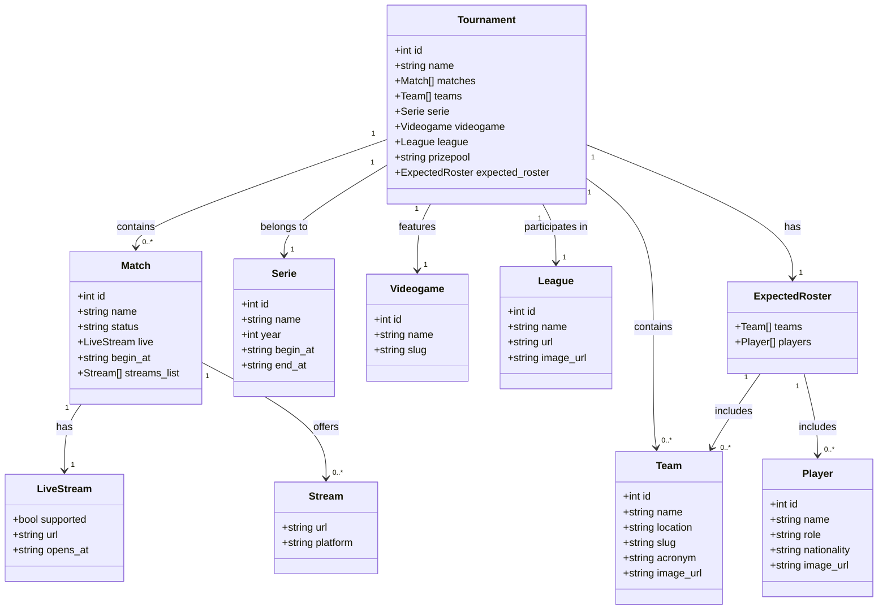

# **Python. Czatbot eSport**

## Wymagania
- 3.0 Ma zaimplementowane minimum 3 ścieżki (stories)
- 3.5 Wyświetla listę dostępnych rozgrywek
- 4.0 Dodaje zawodnika do rozgrywki
- 4.5 Potwierdza dodanie zawodnika wraz z numerem oraz szczegółami turnieju
- 5.0 Wywietlenie wszystkich drużyn, stanu rozgrywki oraz wszystkich zawodników w rozgrywce

# Opis danych API Pandascore

Dane, które zwraca API Pandascore, dotyczą wyników, szczegółów i informacji o wydarzeniach e-sportowych, takich jak mecze w różnych turniejach. Poniżej znajduje się przykładowa struktura danych, która jest zwracana przez API:

## Główne elementy odpowiedzi

### 1. **id**  
ID turnieju lub wydarzenia e-sportowego. W przykładzie: `14942`.

### 2. **name**  
Nazwa turnieju lub wydarzenia. W przykładzie: `"Playoffs"`.

### 3. **matches**  
Lista meczów w ramach danego turnieju. Każdy mecz zawiera szczegóły dotyczące drużyn, statusu, czasu rozpoczęcia i zakończenia itp.

#### Przykład obiektu meczu:
- **id**: ID meczu
- **name**: Nazwa meczu (np. `"Quarterfinals match 1: VER vs ROYALS"`)
- **status**: Status meczu (np. `"not_started"`, `"in_progress"`, `"completed"`)
- **live**: Informacje o transmisji na żywo:
  - `supported`: Czy transmisja na żywo jest obsługiwana (true/false)
  - `url`: Link do transmisji
  - `opens_at`: Czas otwarcia transmisji
- **begin_at**: Czas rozpoczęcia meczu (w formacie ISO 8601)
- **streams_list**: Lista dostępnych transmisji (linki do streamów)

### 4. **teams**  
Lista drużyn biorących udział w turnieju. Każda drużyna zawiera:
- **id**: ID drużyny
- **name**: Nazwa drużyny
- **location**: Kraj drużyny
- **slug**: Unikalny identyfikator drużyny w systemie API
- **acronym**: Akronim drużyny
- **image_url**: Link do obrazu drużyny (jeśli dostępny)

### 5. **serie**  
Szczegóły dotyczące serii, do której należy turniej. Zawiera:
- **id**: ID serii
- **name**: Nazwa serii (np. `"Division 1"`)
- **year**: Rok rozgrywania serii
- **begin_at**: Czas rozpoczęcia serii
- **end_at**: Czas zakończenia serii

### 6. **videogame**  
Informacje o grze, która jest rozgrywana w ramach turnieju. Przykładowo:
- **id**: ID gry
- **name**: Nazwa gry (np. `"Counter-Strike"`)
- **slug**: Unikalny identyfikator gry

### 7. **league**  
Szczegóły dotyczące ligi, w której odbywa się turniej:
- **id**: ID ligi
- **name**: Nazwa ligi (np. `"UKIC"`)
- **url**: Link do strony ligi
- **image_url**: Link do obrazu ligi (jeśli dostępny)

### 8. **prizepool**  
Nagroda finansowa w turnieju. Przykład: `"2500 British Pound"`.

### 9. **expected_roster**  
Lista oczekiwanych drużyn i graczy, którzy wezmą udział w turnieju, wraz z ich danymi:
- **team**: Drużyna
  - **id**: ID drużyny
  - **name**: Nazwa drużyny
  - **image_url**: Link do obrazu drużyny
- **players**: Lista graczy w drużynie, zawierająca:
  - **id**: ID gracza
  - **name**: Imię i nazwisko gracza
  - **role**: Rola gracza w drużynie
  - **nationality**: Kraj pochodzenia gracza
  - **image_url**: Link do obrazu gracza (jeśli dostępny)

