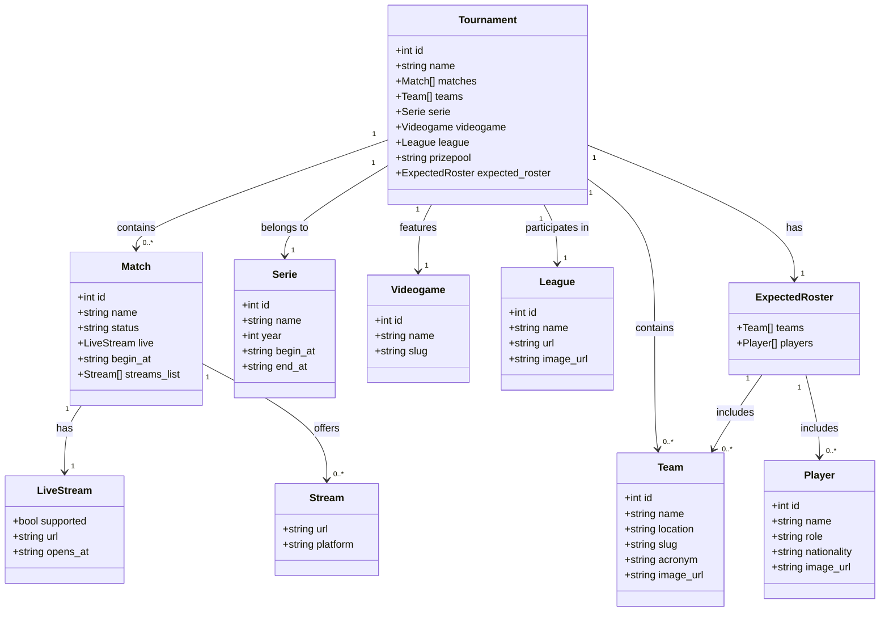

# **Python. Czatbot eSport**

Bot Discord służący do śledzenia turniejów CS2 z wykorzystaniem API Pandascore.

## Funkcjonalności i ocenianie
- **3.0** ✅ Zaimplementowane minimum 3 ścieżki (stories)
- **3.5** ✅ Wyświetla listę dostępnych rozgrywek
- **4.0** ✅ Dodaje zawodnika do rozgrywki
- **4.5** ✅ Potwierdza dodanie zawodnika wraz z numerem oraz szczegółami turnieju
- **5.0** ✅ Wyświetlenie wszystkich drużyn, stanu rozgrywki oraz wszystkich zawodników w rozgrywce

## Komendy
- `/active_games` - Wyświetla listę aktualnie trwających lub nadchodzących meczy CS2
- `/tournament_details [match_or_tournament_id]` - Pokazuje szczegółowe informacje o turnieju
- `/add_player [tournament_id] [player_name] [team_name]` - Dodaje zawodnika do składu drużyny w turnieju
- `/tournament_roster [tournament_id]` - Wyświetla pełne składy wszystkich drużyn w turnieju

## Wymagania
- Python 3.8+
- discord.py
- requests

## Konfiguracja

1. Utwórz plik `.env` w głównym katalogu projektu:
```
DISCORD_TOKEN=twój_token_discord
PANDASCORE_TOKEN=twój_token_pandascore
PANDASCORE_BASE_URL=https://api.pandascore.co
```

2. Zainstaluj wymagane zależności:
```
pip install -r requirements.txt
```

## Uruchomienie
```
python bot/client.py
```

## Struktura projektu
```
├── bot/
│   └── client.py           # Główny plik bota
├── libs/
│   ├── config.py          # Konfiguracja
│   └── pandascore/
│       └── pandascore_libs.py  # Integracja z API Pandascore
├── .env                   # Plik z zmiennymi środowiskowymi
├── README.md
└── requirements.txt
```

# Opis danych API Pandascore

Dane zwracane przez API Pandascore dotyczą wyników, szczegółów i informacji o wydarzeniach e-sportowych. Poniżej znajduje się struktura danych zwracanych przez API:

## Główne elementy odpowiedzi

### 1. **id**  
ID turnieju lub wydarzenia e-sportowego.

### 2. **name**  
Nazwa turnieju lub wydarzenia.

### 3. **matches**  
Lista meczów w ramach danego turnieju. Każdy mecz zawiera:
- **id**: ID meczu
- **name**: Nazwa meczu
- **status**: Status meczu (np. `"not_started"`, `"in_progress"`, `"completed"`)
- **live**: Informacje o transmisji na żywo
- **begin_at**: Czas rozpoczęcia meczu
- **streams_list**: Lista dostępnych transmisji

### 4. **teams**  
Lista drużyn biorących udział w turnieju, zawierająca:
- **id**: ID drużyny
- **name**: Nazwa drużyny
- **location**: Kraj drużyny
- **acronym**: Akronim drużyny
- **image_url**: Link do obrazu drużyny

### 5. **serie**  
Szczegóły dotyczące serii turniejowej:
- **id**: ID serii
- **name**: Nazwa serii
- **year**: Rok rozgrywania
- **begin_at**: Czas rozpoczęcia
- **end_at**: Czas zakończenia

### 6. **videogame**  
Informacje o rozgrywanej grze:
- **id**: ID gry
- **name**: Nazwa gry
- **slug**: Unikalny identyfikator

### 7. **league**  
Szczegóły ligi:
- **id**: ID ligi
- **name**: Nazwa ligi
- **url**: Link do strony
- **image_url**: Link do obrazu

### 8. **prizepool**  
Pula nagród w turnieju.

### 9. **expected_roster**  
Lista oczekiwanych drużyn i graczy:
- **team**: Informacje o drużynie
- **players**: Lista graczy z ich danymi (ID, imię, rola, narodowość)

## Diagram struktury danych

